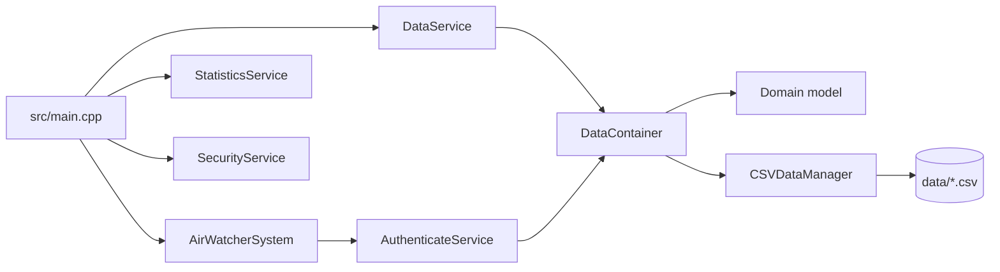
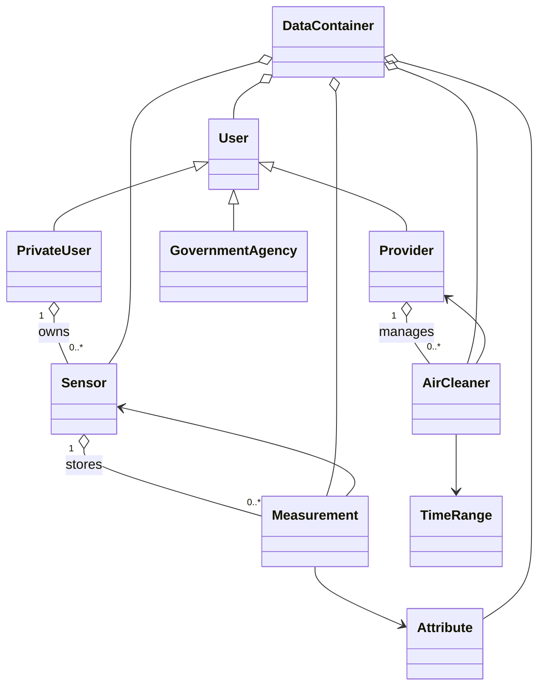

# AirWatcher

AirWatcher est une application console C++17 de surveillance de la qualité de l'air. Elle charge ses données depuis des fichiers CSV, construit un modèle métier en mémoire, puis expose un ensemble de fonctions d'analyse et de sécurité selon le rôle de l'utilisateur connecté.

L'application fonctionne comme une session interactive : on choisit un rôle, on s'authentifie avec un identifiant existant, puis on navigue dans un menu principal et dans un sous-menu spécifique au rôle.

## Sommaire

- Objectif fonctionnel
- Architecture générale
- Arborescence du projet
- Modèle métier
- Persistance CSV et cycle de vie des données
- Couche service
- Déroulé de l'exécution
- Compilation et lancement
- Points d'attention

## Objectif fonctionnel

Le système permet de :

- consulter et analyser des mesures de capteurs ;
- calculer des indicateurs de qualité de l'air, localement ou globalement ;
- comparer des capteurs entre eux ;
- évaluer l'impact de purificateurs d'air ;
- gérer des capteurs privés et l'historique des contributions ;
- vérifier la fiabilité des capteurs et détecter des comportements frauduleux côté agence gouvernementale.

## Architecture générale

Le code suit une séparation en trois couches principales :

1. **Model** : objets métier et relations entre entités.
2. **DAO** : chargement et sauvegarde des données CSV.
3. **Service** : logique métier, filtres d'accès, calculs statistiques et sécurité.

Le point d'entrée est [src/main.cpp](src/main.cpp). Il orchestre :

- le chargement initial des données ;
- l'authentification ;
- l'affichage des menus ;
- l'appel aux services ;
- la sauvegarde finale des données.



### Relations métier principales



## Arborescence du projet

```text
src/
  main.cpp
  dao/
    CSVDataManager.cpp/.h
  model/
    Attribute.cpp/.h
    AirCleaner.cpp/.h
    DataContainer.cpp/.h
    GovernmentAgency.cpp/.h
    Measurement.cpp/.h
    PrivateUser.cpp/.h
    Provider.cpp/.h
    Role.h
    Sensor.cpp/.h
    TimeRange.cpp/.h
    User.cpp/.h
  service/
    AirWatcherSystem.cpp/.h
    AuthenticateService.cpp/.h
    DataService.cpp/.h
    SecurityService.cpp/.h
    StatisticsService.cpp/.h
data/
  attributes.csv
  cleaners.csv
  measurements.csv
  providers.csv
  sensors.csv
  users.csv
```

## Modèle métier

### `User`

Classe de base abstraite pour tous les profils connectables.

- attributs : `userID`, `role` ;
- rôle : fourni par [src/model/Role.h](src/model/Role.h) ;
- héritée par `PrivateUser`, `Provider` et `GovernmentAgency`.

### `PrivateUser`

Représente un citoyen qui consulte les données et possède potentiellement des capteurs.

- stocke un compteur de points ;
- conserve un indicateur de fraude ;
- référence une liste de capteurs associés ;
- peut ajouter ou retirer des capteurs sans en prendre la propriété mémoire.

### `Provider`

Représente l'opérateur de purificateurs d'air.

- référence ses `AirCleaner` ;
- permet de lister les purificateurs associés au compte.

### `GovernmentAgency`

Représente le rôle gouvernemental.

- porte un identifiant d'agence ;
- sert de profil autorisé à exécuter les opérations de sécurité et d'investigation.

### `Sensor`

Capteur physique déployé sur le territoire.

- identifiant métier ;
- latitude et longitude ;
- état de fiabilité ;
- propriétaire éventuel (`PrivateUser*`) ;
- liste de mesures associées.

Le capteur sait aussi calculer une distance géographique vers une position donnée.

### `Measurement`

Une mesure relie :

- une date de mesure (`DateTime`) ;
- un capteur ;
- un attribut de pollution ;
- une valeur numérique ;
- un drapeau de validité.

Les mesures invalidées ne sont pas détruites : elles sont conservées mais exclues des traitements futurs.

### `Attribute`

Décrit un polluant ou un type de mesure.

- identifiant de l'attribut ;
- unité ;
- description.

Exemples observés dans les données : `O3`, `SO2`, `NO2`, `PM10`.

### `AirCleaner`

Représente un purificateur d'air exploité par un fournisseur.

- identifiant ;
- coordonnées géographiques ;
- période de fonctionnement (`TimeRange`) ;
- lien non possédant vers le `Provider` ;
- méthode `isActive()` pour savoir si le purificateur est actif à un instant donné.

### `TimeRange`

Petit objet de valeur pour manipuler un intervalle temporel.

- `start` ;
- `end` ;
- `contains()` pour tester l'appartenance d'un instant ;
- `getDuration()` pour obtenir la durée en secondes.

### `DataContainer`

Le conteneur central en mémoire.

- stocke tous les objets chargés depuis les CSV ;
- expose des accès par identifiant ;
- regroupe aussi les mesures par capteur ;
- possède les objets qu'il contient et les détruit à la fin de vie.

Les autres classes manipulent surtout des pointeurs non possédants vers les entités stockées dedans.

## Persistance CSV et cycle de vie des données

Le chargement initial est assuré par `DataService::reloadAllData()`, qui s'appuie sur `CSVDataManager`.

L'ordre de chargement est important :

1. attributs ;
2. capteurs ;
3. utilisateurs privés ;
4. purificateurs ;
5. fournisseurs ;
6. mesures.

Cet ordre permet de résoudre les références croisées par identifiant au fur et à mesure du chargement.

### Fichiers CSV

| Fichier | Rôle |
| --- | --- |
| `data/attributes.csv` | Catalogue des attributs de mesure |
| `data/sensors.csv` | Capteurs et coordonnées |
| `data/users.csv` | Utilisateurs privés et association à leurs capteurs |
| `data/providers.csv` | Fournisseurs et association à leurs purificateurs |
| `data/cleaners.csv` | Purificateurs d'air et périodes de fonctionnement |
| `data/measurements.csv` | Mesures horodatées par capteur |

### Sauvegarde

Les méthodes de sauvegarde existent dans `CSVDataManager` et sont exposées via `DataService::saveAllData()`. Le programme appelle cette sauvegarde en fin d'exécution, après la boucle principale.

## Couche service

### `AuthenticateService`

Fabrique l'objet métier correspondant à l'identifiant saisi.

- `loginPrivate()` retourne un `PrivateUser*` s'il existe ;
- `loginProvider()` retourne un `Provider*` s'il existe ;
- `loginGovernmentAgency()` crée une instance d'agence gouvernementale.

### `AirWatcherSystem`

Gère l'état de session de l'application.

- conserve l'utilisateur courant typé et générique ;
- expose `setPrivateUser()`, `setProvider()`, `setGovernmentAgency()` ;
- propose `logout()` pour revenir à l'écran de connexion sans quitter l'application.

### `DataService`

Couche d'accès aux données au-dessus du `DataContainer`.

Elle sert à :

- récupérer les capteurs visibles pour un utilisateur donné ;
- récupérer les mesures visibles ;
- retrouver l'historique d'un `PrivateUser` ;
- récupérer les capteurs dans une zone géographique ;
- ajouter une mesure ;
- mettre à jour la fiabilité d'un capteur ;
- recharger ou sauvegarder toutes les données ;
- réinitialiser les drapeaux de corruption temporaires.

Le rôle agit comme un filtre : les requêtes ne renvoient pas les mêmes données selon le profil connecté.

### `StatisticsService`

Service de calcul des indicateurs de qualité de l'air.

Principales responsabilités :

- analyser un capteur sur une période donnée ;
- calculer une moyenne de zone sur un instant ou sur une période ;
- convertir des moyennes de polluants en indice ATMO ;
- comparer des capteurs par similarité ;
- comparer un capteur avec son voisinage ;
- calculer la qualité de l'air autour d'un utilisateur ;
- estimer l'impact d'un purificateur ;
- estimer le rayon utile d'un purificateur ;
- produire un résumé textuel de zone.

### `SecurityService`

Service de sécurité et d'intégrité des données.

Fonctions principales :

- vérifier la fiabilité d'un capteur ;
- détecter les utilisateurs frauduleux ;
- afficher les données corrompues ;
- initialiser ou remettre à zéro la base de sécurité.

Ces opérations sont pensées pour le rôle gouvernemental.

## Déroulé de l'exécution

Le flux réel d'exécution dans [src/main.cpp](src/main.cpp) est le suivant :

1. création d'un `AirWatcherSystem` et d'un `DataContainer` ;
2. initialisation du `DataContainer` dans `DataService` ;
3. chargement des données CSV ;
4. affichage du menu de connexion ;
5. authentification selon le rôle choisi ;
6. affichage du menu principal ;
7. navigation vers le sous-menu spécifique au rôle ;
8. sauvegarde finale des données avant sortie.

Le programme utilise des fonctions utilitaires locales pour gérer les dates :

- `parseDateTime()` ;
- `readDateTime()` ;
- `formatDateTime()`.

Le format attendu pour la saisie est : `YYYY-MM-DD HH:MM:SS`.

## Menus disponibles

### Menu principal

Le menu principal donne accès à :

1. analyser un capteur sur une période ;
2. calculer la qualité de l'air dans une zone à un instant donné ;
3. calculer la qualité de l'air dans une zone sur une période ;
4. comparer des capteurs par similarité ;
5. calculer la qualité de l'air globale à une position et une date ;
6. consulter les purificateurs ;
7. ouvrir le menu spécial selon le rôle ;
8. se déconnecter ;
9. quitter l'application.

### Menu particulier `PRIVATE_USER`

Le sous-menu privé permet de :

- consulter le solde de points ;
- calculer l'AQI de la zone autour de l'utilisateur ;
- comparer les capteurs du voisinage ;
- saisir une nouvelle mesure sur un capteur qui lui appartient ;
- afficher l'historique de ses contributions.

Avant toute saisie de mesure, le code vérifie explicitement que le capteur appartient bien au compte courant.

### Menu particulier `PROVIDER`

Le sous-menu fournisseur permet de :

- voir l'impact d'un purificateur sur une période ;
- comparer un capteur à d'autres capteurs ;
- analyser le rayon de purification utile ;
- consulter les statistiques de zone.

### Menu particulier `GOVERNMENT_AGENCY`

Le sous-menu gouvernemental permet de :

- vérifier si un capteur est défectueux ;
- identifier les comportements frauduleux ;
- recenser les capteurs et les données corrompues ;
- supprimer les données corrompues au sens métier.

## Compilation et lancement

Le projet se compile avec le `Makefile` à la racine.

```bash
make
./main
```

Commandes utiles :

```bash
make clean
make SKIP_CSV=1
```

### Détails du build

- compilateur : `g++` ;
- standard : `C++17` ;
- options : `-Wall -Wextra -Wpedantic` ;
- include path : `-I./src` ;
- cible produite : `main`.

L'option `SKIP_CSV=1` retire `CSVDataManager.cpp` de la compilation. Elle peut être utile dans un environnement où l'on veut tester une partie du code sans la couche CSV.

## Points d'attention

- `DataContainer` centralise la propriété mémoire des objets chargés ; le reste du code manipule surtout des pointeurs non possédants.
- Les opérations de sécurité et de statistiques s'appuient sur des règles métier fortes, mais l'enforcement principal du rôle est fait dans le menu et dans le service d'authentification.
- Les données modifiées en mémoire ne sont persistées que via la sauvegarde finale ou par les méthodes de sauvegarde du `CSVDataManager`.
- Les mesures ou capteurs invalidés ne sont pas supprimés immédiatement ; la logique privilégie une suppression douce.

## Résumé

AirWatcher est donc une application console organisée autour d'un triptyque clair :

- un **modèle métier** riche, centré sur les capteurs, les mesures et les utilisateurs ;
- une **persistance CSV** qui charge et reconstruit l'état applicatif ;
- des **services métier** qui encapsulent les calculs, les filtres d'accès et les contrôles de sécurité.

Cette structure permet de comprendre l'application à partir de trois axes : les données, les droits d'accès et les analyses de qualité de l'air.
